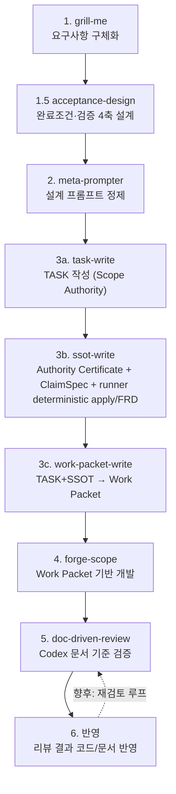

# DEVELOPMENT_PIPELINE — 개발 파이프라인 설계

> 이 레포의 기존 스킬을 조합해 **요구사항 → 설계 문서 → 개발 → 검증 → 반영** 닫힌 루프를 정의하는 프로세스 설계 문서. SSOT 분류(PRD/FRD/TASK/ADR) 아닌 프로세스 문서. 문서 작성 룰은 [DOCUMENT_GUIDE](.templates/DOCUMENT_GUIDE.md) 준수.

| 항목 | 값 |
|---|---|
| 문서 ID | DEVELOPMENT_PIPELINE (단일 파일) |
| 버전 | 1.3 (Draft) |
| 작성 가정 | 기존 스킬(grill-me/acceptance-design/meta-prompter/task-write/ssot-write/work-packet-write/forge-scope/doc-driven-review) 실존. v0.7 per-App SSOT 체계 전제 |
| 관련 문서 | [DOCUMENT_GUIDE](.templates/DOCUMENT_GUIDE.md) · [CLAUDE](../CLAUDE.md) |

## 변경 이력
| 버전 | 일자 | 변경 요약 | 작성자 |
|---|---|---|---|
| 0.1 | 2026-05-31 | 초안 — 6단계 파이프라인 정의, step3 분기, 향후 보완 backlog | jaecheon.jeong |
| 0.2 | 2026-06-09 | step 1.5 acceptance-design(완료조건·엣지·오류·검증 4축 설계) 삽입 | jaecheon.jeong |
| 0.3 | 2026-07-03 | docs-add-task 폐지 — step3 을 task-write→ssot-write→work-packet-write 트리오로 분할 | jaecheon.jeong |
| 0.4 | 2026-07-10 | ssot-write를 Opus 오케스트레이터·planner·auditor와 Sonnet actor의 컨텍스트 격리 멀티 에이전트 흐름으로 전환 | jaecheon.jeong |
| 0.5 | 2026-07-10 | ssot-write 메인의 TASK·역할 템플릿 사전 열람을 금지하고 감사 실패를 execution repair와 plan replan으로 분리 | jaecheon.jeong |
| 0.6 | 2026-07-10 | ssot-write all-SKIP fast path, summary 없는 구조 envelope, artifact registry reducer, TASK↔최신 ADR precedence/downstream constraint 추가 | jaecheon.jeong |
| 0.7 | 2026-07-11 | ssot-write 상태·전이·권한·baseline diff를 deterministic runner Contract v4로 강제 | jaecheon.jeong |
| 0.8 | 2026-07-11 | ssot-write Contract v5에서 문서유형별 판단·파일별 편집/검토·교차 감사를 분리하고 runner가 plan을 컴파일 | jaecheon.jeong |
| 0.8 | 2026-07-11 | ssot-write helper 검사를 runner gate로 이동하고 no-op/finalize 이벤트 및 verbatim final-report 추가 | jaecheon.jeong |
| 0.9 | 2026-07-11 | ssot-write 동일 타입 다중 artifact action과 dispatch/누적 승인 권한 분리 추가 | jaecheon.jeong |
| 1.0 | 2026-07-11 | ssot-write task outcome/downstream, precedence 조합, ADR 상태와 rejected result를 runner gate로 이동 | jaecheon.jeong |
| 1.1 | 2026-07-11 | ssot-write Contract v6 — 전체 변경 Opus 제안·fresh Opus 계획/결과 비판, Sonnet staging, runner 관계 gate·journaled commit/rollback으로 전환 | jaecheon.jeong |
| 1.2 | 2026-07-11 | ssot-write Contract v7 — exact ChangeSpec/compiled preview/structured apply와 선택적 신규 FRD prose JSON 렌더링으로 Sonnet 자유 편집 제거 | jaecheon.jeong |
| 1.3 | 2026-07-11 | ssot-write Contract v8 — mandatory Opus Authority Certificate, certificate-bound ClaimSpec, runner deterministic preview/FRD assembly, fresh Change/Outcome Critic, 별도 risk approval, bounded optional Sonnet prose로 권위·작성 책임 분리 | jaecheon.jeong |
| 1.4 | 2026-07-12 | ssot-write v8 — runner-owned evidence ID→exact quote 정규화, Authority 후보별 coverage, 실행 구현 SHA 동결, 전 과정·결과 한국어 계약 추가 | jaecheon.jeong |

## 0. 목적

흩어진 스킬을 하나의 개발 흐름으로 묶는다. 목표:

- **단일 진실원천**: 설계 문서(FRD/TASK)를 1급 산출물로 두고 개발·검증이 같은 문서를 참조
- **책임 분리**: 단계마다 단일 책임 (캐묻기 / 완료조건·검증설계 / 정제 / 문서산출 / 개발 / 검증 / 반영)
- **검증 가능**: 개발 결과를 문서 기준으로 기계 검증 (Conformance%)

## 1. 파이프라인 개요

## 2. 단계별 명세

| 단계 | 스킬/커맨드 | 입력 | 출력 | 책임 |
|---|---|---|---|---|
| 1 | `grill-me` | 거친 아이디어/계획 | 합의된 요구사항 (대화형) | 모호함을 집요한 질문으로 구체화. 논리 공백 지적 |
| 1.5 | `acceptance-design` | grill-me 정리본 (doc) | 완료조건·엣지케이스·오류케이스·검증방법 4축 설계본 (대화형) | doc 기준 "끝의 정의"와 검증을 같이 설계 |
| 2 | `meta-prompter` | grill-me 결과 + 4축 설계본 | 한국어 개조식 메타프롬프트 (마크다운 코드블록) | 요구사항을 다음 단계가 안정 수행할 구조화 프롬프트로 정제 |
| 3a | `task-write` | 요구사항 문서 또는 자연어 요청 | `docs/<App>/TASK/<App>-TASK-<NNN>.md` (Scope Authority — 목적·범위·비목표·완료기준·엣지·오류·테스트만). 영구 SSOT 는 생성·수정·분석하지 않음 | TASK 작성 + read-only 서브에이전트 자체 검증 |
| 3b | `ssot-write` | task-write 산출 TASK | 영향 SSOT upsert + `.process/<TASK-stem>/source.json`, document index, authority/governance graph, evidence catalog, Authority 후보 coverage receipt, mandatory Authority Certificate, ClaimSpec, deterministic compiled preview/FRD, Change/Outcome certificates, approved contract, structured staging/optional bounded prose JSON, checks, commit receipt, generated views | Contract v8 runner가 evidence ID를 실제 path·line·quote로 정규화하고 TASK 아키텍처 후보별 판정 coverage·구현 SHA·한국어 자연어를 검증한다. fresh Opus Authority Critic이 TASK/ADR/DDD/문서 권위를 인증하고, Opus ClaimSpec Thinker가 atomic claims를 제안하며 fresh Change/Outcome Critic이 전후 결과를 반증한다. 별도 risk approval 뒤 필요한 신규 FRD 설명 prose만 Sonnet이 렌더링 |
| 3c | `work-packet-write` | task-write TASK + ssot-write 반영 SSOT/matrix/downstream constraints | `App-WORK_PACKET/App-WP-<NNN>.md` — Ready gate, 연결 TASK, Required SSOT Execution Matrix, Implementation Output Contract | TASK/SSOT와 explicit supersession constraint를 연결해 forge 실행용 Work Packet만 생성 (TASK/SSOT/코드 수정 안 함) |
| 4 | `forge-scope` | work-packet-write 산출 Work Packet | `phases/scoped/<phase-dir>/index.json` + `step{N}.md` + 코드 | Work Packet 기반 경량 scoped 개발 실행 |
| 5 | `doc-driven-review` | doc-path (1개 이상) | Missing / Improve / Overengineered / Conformance(%) | Codex 위임 — 문서가 코드 변경점에 반영됐는지 검증 |
| 6 | (수동) | 리뷰 결과 | 반영된 코드/문서 | Missing 보강, Overengineered 제거, Improve 판단 반영 |

## 3. 분기 규칙 (step 3)

step3 는 **task-write → ssot-write → work-packet-write** 3단 체인. 옛 `docs-add-task` monolith(단일 진입점 + 내부 자산별 upsert)가 책임별로 분해됐다:

- **task-write (3a)** — 요구사항을 TASK 로만 좁힌다. 신규/기존 판단·영구 SSOT 분석을 하지 않는다 (그 판단은 3b 책임). App 결정 + TASK 번호 할당 + 본문 작성 + read-only 서브에이전트 자체 검증.
- **ssot-write (3b)** — TASK 를 입력으로 받아 영향 SSOT 를 upsert. 신규/기존 판단은 여기서 수행:
  - **신규 기능** → 해당 App `{App}-FC.md` 에 대응 기능 행 **없음**. 새 FRD 20절 신설, App-PRD §3.1/§7 갱신, FC 5표 행 추가.
  - **기존 수정/개선/refactor** → FC 에 이미 기능 행 **존재** (또는 운영성 work_type). 영향 FRD 다수 자동 식별 후 영향 FRD 갱신, FC 행 상태 갱신.
  - **혼합 허용** — 한 TASK 에서 신규 FRD 신설 + 기존 FRD 갱신 동시 가능.
  - **ADR 은 필요 시** — 새 결정이면 신설, 기존 결정 변경이면 기존 ADR 수정(supersede/in-place), 결정 없으면 생략. op 따라 ADR-CATALOG 동기화.
  - **결정적 control plane** — `ssot_runner.py`가 init/resume, bounded packet, strict artifact/path/hash, retry cap, 별도 risk gate, terminal outcome, final report를 소유한다. 메인은 runner가 생성한 `prompt_path`와 사용자 질문만 중계한다. wrapper는 v5/v6/v7 process를 각 구버전으로 재개하고 신규 process만 v8로 생성한다.
  - **권위 선행 인증** — fresh Opus Authority Critic이 TASK·ADR status/supersession·DDD layer·문서 governance·scope 다섯 mandatory check를 exact path/line/quote evidence로 인증한다. certificate FAIL/BLOCKED는 ClaimSpec 계획 전에 중단한다.
  - **전수 증거 coverage** — TASK 명시 ADR과 supersession chain 본문을 Authority packet에 강제하고, Change Critic의 모든 action/path/receipt와 Outcome Critic의 모든 staged changed path 인용을 runner가 전수 대조한다.
  - **사용자 답변 재인증** — risk approval 외의 권위·검증 질문 답변은 기존 Authority Certificate와 모든 파생 proposal/preview를 무효화하고, 답변이 기록된 decision을 새 Authority Critic이 다시 인증한 뒤에만 계획을 재개한다.
  - **인지 단계 역할 분리** — Opus ClaimSpec Thinker가 certificate 안에서만 atomic claim과 여섯 SSOT exact mutation을 만들고 runner가 실제 compiled preview와 claim 기반 FRD 골격을 생성한다. fresh Opus Change Critic이 certificate+ClaimSpec+preview를 반증하고, 별도 interactive risk approval 후 fresh Opus Outcome Critic이 전체 staging 결과를 다시 반증한다.
  - **결정적 structured apply** — UPDATE는 runner가 exact precondition과 operation receipt를 검증해 staging에 재현한다. 신규 FRD는 hash로 동결한 canonical 20절 template contract·claim·관계로 runner가 조립하며 model-authored 전체 FRD, raw document body, `CREATE_EXACT`를 허용하지 않는다. 0회·복수 anchor나 미지원 변환은 Sonnet 자유 편집으로 우회하지 않는다.
  - **제한된 renderer** — Sonnet은 의미가 claims로 완결된 신규 FRD의 선택적 bounded 설명 block만 Markdown artifact JSON으로 만든다. 문서 파일·버전·표·링크·acceptance/test·정책·수치를 직접 편집하거나 결정하지 않으며 실패 시 runner deterministic claim bullet로 fallback한다.
  - **transactional write boundary** — runner가 격리 staging overlay에서 관계/governance/helper/ADR/hash 검사를 통과한 결과만 App advisory lock·write-ahead journal·전체 backup/temp와 함께 반영한다. 중간 종료는 다음 실행에서 hash 기반 rollback 또는 COMMITTED roll-forward하며, 제3자 내용은 덮지 않는다.
  - **관계 계약** — `approved-contract.json`이 exact action/mutation/skip뿐 아니라 FC↔FRD trace, ADR disposition, semantic 관계를 소유한다. CREATE FRD의 FC 링크·§17·§18와 ADR 재사용 후 stale placeholder를 runner가 검사한다.
  - **보정 루프** — PLAN/결정적 변경 결함은 staging을 폐기하고 Thinker revision으로 분기한다. prose renderer 실패는 결정 범위를 확대하지 않고 runner fallback 또는 안전한 terminal로 끝낸다.
  - **terminal 분리** — DONE/NOOP만 WORK_PACKET으로 진행한다. OBSOLETE는 STOP, REWRITE_REQUIRED는 task-write, MANUAL_REQUIRED와 USER_REJECTED/PLAN_REJECTED/VERIFY_FAILED/commit recovery 결과는 pipeline blocked다.
  - **입력 precedence** — TASK는 목적·범위, Accepted ADR은 설계 결정 권위다. approved authority relation은 generated build constraint로 work-packet-write에 전달하고 암묵적 충돌은 BLOCKED한다.
- **work-packet-write (3c)** — TASK + 반영된 SSOT를 연결해 forge 실행용 Work Packet만 생성한다. ssot build의 `CURRENT_SSOT_WINS` authority는 SKIP이어도 Required 입력과 실행 규칙에 포함한다. TASK/SSOT/코드는 수정하지 않는다.

TASK 는 휘발성 + 외부 SSOT 인용 금지 ([DOCUMENT_GUIDE §1.2](.templates/DOCUMENT_GUIDE.md) 룰).

요구사항 정합 검증은 단계별로 분산됐다(monolith 의 "요구↔전체생성문서" 단일 99%/3회 루프는 폐지): task-write 는 TASK 파일 1개만 `docs_conformance.py` 로 채점하고, ssot-write 는 mandatory Authority Certificate, certificate-bound ClaimSpec, fresh Change/Outcome Critic, runner deterministic preview/FRD·관계 gate, 선택적 bounded prose renderer로 요구↔영구 SSOT를 검증한다. 모든 의미 역할은 runner의 hash-bound file/byte budget packet만 읽으며 exact evidence 없이 PASS할 수 없다. **step5 `doc-driven-review`(문서↔코드)와는 검증 축이 다르다**: step3 검증 = 요구↔문서, step5 = 문서↔코드.

## 4. 데이터 흐름 / SSOT

- 설계 문서(FRD/TASK)가 **단일 진실원천**. step4 forge-scope 와 step5 doc-driven-review 가 **같은 문서**를 참조 → 개발 의도와 검증 기준 일치.
- forge-scope 산출물(`phases/scoped/<dir>/`)은 개발 추적용. 영구 추적은 docs/ SSOT + 코드.
- doc-driven-review 는 working-tree + untracked 변경점을 문서 기준으로 대조 → Conformance% 산출.
- ssot-write의 상태 원본은 `state.json`과 `events.jsonl`이다. build/progress 네 문서는 호환성과 사람이 읽는 진행 상황을 위한 runner-generated view이며 어떤 에이전트도 직접 수정하지 않는다. `governance.json`, mandatory Authority Certificate, certificate-bound ClaimSpec, compiled preview/operation receipt, Change/Outcome certificates, `approved-contract.json`, baseline/staging/patch/checks/commit manifest가 실제 변경과 검증 증거다.

## 5. 향후 보완 (Backlog)

현행 파이프라인은 골격만 갖춘 단방향(폭포수) 흐름. 합의된 약점 — **진행하며 보완**:

| # | 보완 항목 | 위치 | 문제 |
|---|---|---|---|
| 1 | **verify-gate** | step4 ↔ step5 사이 | 빌드/테스트 통과 확인 단계 없음. 깨진 코드가 리뷰로 흘러감 |
| 2 | **branch-review (Standards 축)** | step5 보강 | doc-driven-review 는 Spec(문서 일치)만 검증. 코딩 컨벤션/Standards 축 누락 → `branch-review` 스킬로 보완 |
| 3 | **재검토 루프** | step6 → step5 | 반영이 1-shot. 반영이 새 결함 넣어도 모름 → Conformance 임계치까지 반복 |
| 4 | **commit 마무리** | step6 이후 | 파이프라인 끝이 working-tree 더미. `commit-analysis` 스킬로 커밋 마감 |
| 5 | **피드백 문서 역류 경로** | step5 → step3 | 리뷰가 "문서 자체 결함/오버엔지니어링" 잡아도 문서로 되돌아갈 경로 없음 (단방향 한계) |

위 항목은 별도 후속 작업. 본 문서는 현행 흐름 + backlog 기록까지를 범위로 한다.
