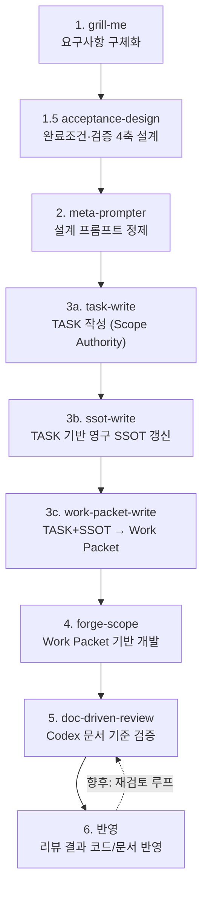

# DEVELOPMENT_PIPELINE — 개발 파이프라인 설계

> 이 레포의 기존 스킬을 조합해 **요구사항 → 설계 문서 → 개발 → 검증 → 반영** 닫힌 루프를 정의하는 프로세스 설계 문서. SSOT 분류(PRD/FRD/TASK/ADR) 아닌 프로세스 문서. 문서 작성 룰은 [DOCUMENT_GUIDE](.templates/DOCUMENT_GUIDE.md) 준수.

| 항목 | 값 |
|---|---|
| 문서 ID | DEVELOPMENT_PIPELINE (단일 파일) |
| 버전 | 0.3 (Draft) |
| 작성 가정 | 기존 스킬(grill-me/acceptance-design/meta-prompter/task-write/ssot-write/work-packet-write/forge-scope/doc-driven-review) 실존. v0.7 per-App SSOT 체계 전제 |
| 관련 문서 | [DOCUMENT_GUIDE](.templates/DOCUMENT_GUIDE.md) · [CLAUDE](../CLAUDE.md) |

## 변경 이력
| 버전 | 일자 | 변경 요약 | 작성자 |
|---|---|---|---|
| 0.1 | 2026-05-31 | 초안 — 6단계 파이프라인 정의, step3 분기, 향후 보완 backlog | jaecheon.jeong |
| 0.2 | 2026-06-09 | step 1.5 acceptance-design(완료조건·엣지·오류·검증 4축 설계) 삽입 | jaecheon.jeong |
| 0.3 | 2026-07-03 | docs-add-task 폐지 — step3 을 task-write→ssot-write→work-packet-write 트리오로 분할 | jaecheon.jeong |

## 0. 목적

흩어진 스킬을 하나의 개발 흐름으로 묶는다. 목표:

- **단일 진실원천**: 설계 문서(FRD/TASK)를 1급 산출물로 두고 개발·검증이 같은 문서를 참조
- **책임 분리**: 단계마다 단일 책임 (캐묻기 / 완료조건·검증설계 / 정제 / 문서산출 / 개발 / 검증 / 반영)
- **검증 가능**: 개발 결과를 문서 기준으로 기계 검증 (Conformance%)

## 1. 파이프라인 개요

## 2. 단계별 명세

| 단계 | 스킬/커맨드 | 입력 | 출력 | 책임 |
|---|---|---|---|---|
| 1 | `grill-me` | 거친 아이디어/계획 | 합의된 요구사항 (대화형) | 모호함을 집요한 질문으로 구체화. 논리 공백 지적 |
| 1.5 | `acceptance-design` | grill-me 정리본 (doc) | 완료조건·엣지케이스·오류케이스·검증방법 4축 설계본 (대화형) | doc 기준 "끝의 정의"와 검증을 같이 설계 |
| 2 | `meta-prompter` | grill-me 결과 + 4축 설계본 | 한국어 개조식 메타프롬프트 (마크다운 코드블록) | 요구사항을 다음 단계가 안정 수행할 구조화 프롬프트로 정제 |
| 3a | `task-write` | 요구사항 문서 또는 자연어 요청 | `docs/<App>/TASK/<App>-TASK-<NNN>.md` (Scope Authority — 목적·범위·비목표·완료기준·엣지·오류·테스트만). 영구 SSOT 는 생성·수정·분석하지 않음 | TASK 작성 + read-only 서브에이전트 자체 검증 |
| 3b | `ssot-write` | task-write 산출 TASK | 영향 PRD/FC/FRD/ADR/ADR-CATALOG upsert (신규 기능: FRD 신설 + PRD §3.1/§7 + FC 행 / 기존 영향: FRD 갱신 + FC 행 상태 갱신). ADR 은 결정 유무에 따라 신설/수정/생략, op 따라 ADR-CATALOG 동기화 | read-only 서브에이전트 영향 분석·감사 후 메인 에이전트가 SSOT 직접 수정 |
| 3c | `work-packet-write` | task-write TASK + ssot-write 반영 SSOT | `App-WORK_PACKET/App-WP-<NNN>.md` — Ready gate, 연결 TASK, Required SSOT Execution Matrix, Implementation Output Contract | TASK/SSOT 연결해 forge 실행용 Work Packet만 생성 (TASK/SSOT/코드 수정 안 함) |
| 4 | `forge-scope` | work-packet-write 산출 Work Packet | `phases/scoped/<phase-dir>/index.json` + `step{N}.md` + 코드 | Work Packet 기반 경량 scoped 개발 실행 |
| 5 | `doc-driven-review` | doc-path (1개 이상) | Missing / Improve / Overengineered / Conformance(%) | Codex 위임 — 문서가 코드 변경점에 반영됐는지 검증 |
| 6 | (수동) | 리뷰 결과 | 반영된 코드/문서 | Missing 보강, Overengineered 제거, Improve 판단 반영 |

## 3. 분기 규칙 (step 3)

step3 는 **task-write → ssot-write → work-packet-write** 3단 체인. 옛 `docs-add-task` monolith(단일 진입점 + 내부 자산별 upsert)가 책임별로 분해됐다:

- **task-write (3a)** — 요구사항을 TASK 로만 좁힌다. 신규/기존 판단·영구 SSOT 분석을 하지 않는다 (그 판단은 3b 책임). App 결정 + TASK 번호 할당 + 본문 작성 + read-only 서브에이전트 자체 검증.
- **ssot-write (3b)** — TASK 를 입력으로 받아 영향 SSOT 를 upsert. 신규/기존 판단은 여기서 수행:
  - **신규 기능** → 해당 App `{App}-FC.md` 에 대응 기능 행 **없음**. 새 FRD 20절 신설, App-PRD §3.1/§7 갱신, FC 5표 행 추가.
  - **기존 수정/개선/refactor** → FC 에 이미 기능 행 **존재** (또는 운영성 work_type). 영향 FRD 다수 자동 식별 후 영향 FRD 갱신, FC 행 상태 갱신.
  - **혼합 허용** — 한 TASK 에서 신규 FRD 신설 + 기존 FRD 갱신 동시 가능.
  - **ADR 은 필요 시** — 새 결정이면 신설, 기존 결정 변경이면 기존 ADR 수정(supersede/in-place), 결정 없으면 생략. op 따라 ADR-CATALOG 동기화.
  - read-only 서브에이전트 영향 분석·감사 후 메인 에이전트가 SSOT 직접 수정 (in-place).
- **work-packet-write (3c)** — TASK + 반영된 SSOT 를 연결해 forge 실행용 Work Packet 만 생성. TASK/SSOT/코드는 수정하지 않는다.

TASK 는 휘발성 + 외부 SSOT 인용 금지 ([DOCUMENT_GUIDE §1.2](.templates/DOCUMENT_GUIDE.md) 룰).

요구사항 정합 검증은 단계별로 분산됐다(monolith 의 "요구↔전체생성문서" 단일 99%/3회 루프는 폐지): task-write 는 TASK 파일 1개만 `docs_conformance.py` 로 채점, ssot-write 는 read-only 서브에이전트 감사로 대체. **step5 `doc-driven-review`(문서↔코드)와는 검증 축이 다르다**: step3 검증 = 요구↔문서, step5 = 문서↔코드.

## 4. 데이터 흐름 / SSOT

- 설계 문서(FRD/TASK)가 **단일 진실원천**. step4 forge-scope 와 step5 doc-driven-review 가 **같은 문서**를 참조 → 개발 의도와 검증 기준 일치.
- forge-scope 산출물(`phases/scoped/<dir>/`)은 개발 추적용. 영구 추적은 docs/ SSOT + 코드.
- doc-driven-review 는 working-tree + untracked 변경점을 문서 기준으로 대조 → Conformance% 산출.

## 5. 향후 보완 (Backlog)

현행 파이프라인은 골격만 갖춘 단방향(폭포수) 흐름. 합의된 약점 — **진행하며 보완**:

| # | 보완 항목 | 위치 | 문제 |
|---|---|---|---|
| 1 | **verify-gate** | step4 ↔ step5 사이 | 빌드/테스트 통과 확인 단계 없음. 깨진 코드가 리뷰로 흘러감 |
| 2 | **branch-review (Standards 축)** | step5 보강 | doc-driven-review 는 Spec(문서 일치)만 검증. 코딩 컨벤션/Standards 축 누락 → `branch-review` 스킬로 보완 |
| 3 | **재검토 루프** | step6 → step5 | 반영이 1-shot. 반영이 새 결함 넣어도 모름 → Conformance 임계치까지 반복 |
| 4 | **commit 마무리** | step6 이후 | 파이프라인 끝이 working-tree 더미. `commit-analysis` 스킬로 커밋 마감 |
| 5 | **피드백 문서 역류 경로** | step5 → step3 | 리뷰가 "문서 자체 결함/오버엔지니어링" 잡아도 문서로 되돌아갈 경로 없음 (단방향 한계) |

위 항목은 별도 후속 작업. 본 문서는 현행 흐름 + backlog 기록까지를 범위로 한다.
