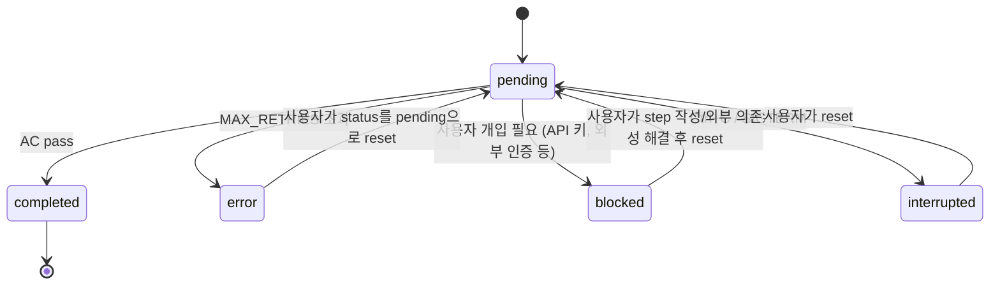

# Phase Schema

`phases/` 디렉토리 구조와 `index.json` 스키마, step 라이프사이클 정의.

## 디렉토리 구조

```
phases/
├── full/                     # forge_full 전용 (문서 기반 full phase 실행/plan 생성)
│   ├── index.json            # (선택) top-level — 여러 phase 추적
│   └── <phase-dir>/          # phase 디렉토리. 이름은 [A-Za-z0-9._-] 만 허용, 케밥/스네이크 권장
│       ├── index.json        # 필수 — step 목록과 상태
│       ├── step0.md          # 필수 — step별 지시
│       ├── step1.md
│       ├── step{N}.md
│       ├── step0-output.json # 자동 생성 — Claude의 stdout/stderr/exitCode
│       └── step{N}-output.json
└── scoped/                   # forge_scope 전용 (특정 docs_scope 파일만 주입)
    ├── index.json            # (선택) top-level — 여러 phase 추적
    └── <phase-dir>/          # phase 디렉토리
        ├── index.json        # 필수 — step 목록·상태 + docs_scope 필드(주입 대상 파일)
        ├── step0.md          # 필수 — step별 지시
        ├── step1.md
        ├── step{N}.md
        ├── step0-output.json # 자동 생성 — Claude의 stdout/stderr/exitCode
        └── step{N}-output.json
```

> **물리적 분리 원칙** — `forge_full`은 `phases/full/` 만, `forge_scoped`는 `phases/scoped/` 만 읽는다. 폴더 자체가 경계를 강제하므로 잘못된 커맨드로 phase 실행 시 phase가 보이지 않아 즉시 reject된다 (메타데이터 검증 없이도 안전).

## Top-level `phases/full/index.json` (선택)

여러 phase를 한 번에 추적할 때 사용. Forge 자체는 이 파일이 없어도 동작하나, 존재 시 phase 진행 상태를 자동으로 갱신한다. (`forge_scoped`는 별도로 `phases/scoped/index.json` 사용.)

```json
{
  "phases": [
    {"dir": "0-mvp", "status": "pending"},
    {"dir": "1-polish", "status": "pending"}
  ]
}
```

`dir`은 phase 디렉토리 이름. `status`는 `pending`/`completed`/`error`/`blocked` 중 하나. Forge가 phase 종료 시 `completed_at`/`failed_at`/`blocked_at` 타임스탬프를 자동 추가한다.

## Phase 단위 `index.json`

```json
{
  "project": "MyApp",
  "phase": "mvp",
  "guardrails": {
    "mode": "explicit",
    "docs": ["docs/PRD.md", "docs/FRD/FRD-F009.md"]
  },
  "created_at": "2026-05-01T10:00:00+0900",
  "completed_at": "2026-05-01T11:30:00+0900",
  "steps": [
    {
      "step": 0,
      "name": "scaffold",
      "status": "completed",
      "summary": "src/ 디렉토리와 entry point 생성",
      "started_at": "2026-05-01T10:00:00+0900",
      "completed_at": "2026-05-01T10:15:00+0900"
    },
    {
      "step": 1,
      "name": "core-logic",
      "status": "pending"
    }
  ]
}
```

### 최상위 필드

| 필드 | 타입 | 의미 |
|-----|------|------|
| `project` | str | 프로젝트 이름. Claude prompt에 삽입됨. |
| `phase` | str | Phase 이름. branch 명(`feat-<phase>`) + commit 메시지 prefix에 사용. |
| `guardrails` | object | 선택. `forge_full` 문서 주입 정책. 없으면 기존 호환을 위해 `{"mode":"root","docs":[]}`로 해석. |
| `created_at` | str (ISO+09:00) | Forge가 첫 실행 시 자동 추가. |
| `completed_at` | str (ISO+09:00) | 모든 step 완료 시 자동 추가. |
| `steps` | array | step 객체 목록. |

### `forge_full` guardrails 필드

`guardrails`는 `forge_full` 전용 선택 필드다. `forge_scope`의 `docs_scope`와 공유하지 않는다.

```json
{
  "guardrails": {
    "mode": "root",
    "docs": []
  }
}
```

| 필드 | 값 | 의미 |
|-----|----|------|
| `mode` | `root` | `CLAUDE.md` + `docs/*.md`만 주입. 기존 full phase 호환 기본값. |
| `mode` | `recursive` | `CLAUDE.md` + `docs/**/*.md` 주입. `docs/_templates/**` 제외. |
| `mode` | `explicit` | `CLAUDE.md` + `docs` 배열에 명시된 문서만 주입. |
| `docs` | string[] | `docs/` 하위 `.md` 경로만 허용. absolute path, `..`, backslash 금지. |

신규 `forge_full` plan 생성은 `--doc`이 있으면 `explicit`, 없으면 `recursive`를 기본으로 사용한다.
기존 phase 실행에서 `guardrails`가 없으면 `root`로 해석하므로 과거 phase와 호환된다.

### Step 객체 필드

| 필드 | 타입 | 필수 | 의미 |
|-----|------|------|------|
| `step` | int | ✓ | 0부터 시작하는 step 번호. 중복 불가. |
| `name` | str | ✓ | 짧은 식별자. commit 메시지의 `feat({phase}): step N — {name}`에 사용. |
| `status` | str | ✓ | 라이프사이클 상태(아래 다이어그램). |
| `summary` | str |  | `completed` 시 Claude가 작성하는 한 줄 요약. 다음 step의 prompt에 전달. |
| `error_message` | str |  | `error` 상태일 때 실패 사유. |
| `blocked_reason` | str |  | `blocked` 상태일 때 사용자 개입이 필요한 이유. |
| `started_at` | str |  | Forge가 step 시작 시 자동 기록. |
| `completed_at` | str |  | `completed` 진입 시 자동 기록. |
| `failed_at` | str |  | `error` 진입 시 자동 기록. |
| `blocked_at` | str |  | `blocked` 진입 시 자동 기록. |
| `interrupted_at` | str |  | `interrupted` 진입 시 자동 기록 (Ctrl+C/SIGTERM). |

## Status 라이프사이클



### 상태 전이 규칙

- **`pending` → `completed`**: Claude가 AC(Acceptance Criteria)를 통과시키면 직접 `status="completed"` + `summary` 갱신.
- **`pending` → `error`**: `MAX_RETRIES`(기본 3회) 자가 교정 후에도 실패 시. Forge가 자동 기록.
- **`pending` → `blocked`**: API 키·외부 인증·수동 설정이 필요한 경우 Claude가 직접 `status="blocked"` + `blocked_reason` 기록.
- **`pending` → `interrupted`**: 사용자가 Ctrl+C 또는 시스템이 SIGTERM 전송. Forge가 자동 기록 후 exit 130.
- **`error`/`blocked`/`interrupted` → `pending`**: **사용자가 직접** `index.json`을 편집하여 reset해야 한다. 다음 실행 시 해당 step부터 재개.

### 종료 코드

| Code | 의미 |
|-----|------|
| `0` | 모든 step `completed`. |
| `1` | step 1개 이상 `error` 상태로 종료. |
| `2` | step 1개 이상 `blocked` 상태로 종료. |
| `130` | KeyboardInterrupt/SIGTERM 수신. |

## `step{N}.md` 작성 가이드

각 step.md는 Claude에게 주는 단일 지시이다. 다음 7가지 원칙을 따른다:

1. **Scope 최소화** — 한 step은 한 번에 검증 가능한 작은 단위. 너무 크면 분할.
2. **자기 완결성** — 외부 문서·다른 step에 대한 모호한 참조 금지. 필요한 정보는 prompt에 직접 포함되거나 `summary` 통해 전달됨.
3. **선행 작업 명시** — "step N의 산출물을 사용한다" 같은 의존성을 명확히. (이전 step `summary`로 자동 전달됨)
4. **시그니처 수준 지시** — 함수/타입/파일 이름 등 구체적으로. 모호한 "적절히"는 피한다.
5. **실행 가능한 AC** — Claude가 직접 실행하여 통과를 검증할 수 있는 조건. 예: `npm test`, `python -c "import X"`, 특정 파일 존재 확인.
6. **구체적 경고** — "이러이러한 상황에서는 ~하지 말 것"을 명시 (Anti-pattern).
7. **명명** — kebab-case slug (`step3-auth-flow`가 아니라 `name: "auth-flow"`로 step 객체에).

### 예시

```markdown
# Step 0: scaffold

src/ 디렉토리와 entry point를 만드세요.

## 작업
- `src/index.ts` 작성 — 빈 모듈, `export {}` 한 줄
- `package.json`에 `"type": "module"`, `"main": "src/index.ts"` 필드 추가

## 사용 금지
- 외부 의존성 추가 금지 (이 step은 scaffold만)
- 테스트 프레임워크 도입 금지 (다음 step에서)

## AC (실행하여 검증)
- `node -e "require.resolve('./src/index.ts')"` 가 throw 없이 통과
- `package.json`을 `JSON.parse`로 읽어 `type === 'module'`인지 확인
```

## 예시 phase 디렉토리

```
phases/full/0-mvp/
├── index.json
├── step0.md       # scaffold
├── step1.md       # core types
├── step2.md       # entry CLI
├── step0-output.json   (자동 생성)
├── step1-output.json
└── step2-output.json
```

```json
{
  "project": "MyApp",
  "phase": "mvp",
  "steps": [
    {"step": 0, "name": "scaffold", "status": "pending"},
    {"step": 1, "name": "core-types", "status": "pending"},
    {"step": 2, "name": "entry-cli", "status": "pending"}
  ]
}
```
